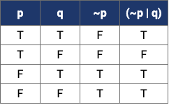
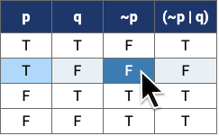

# Truth Table Builder

This is a simple web application that builds truth tables for boolean expressions. 
It's intended as an aid to learning boolean arithmetic.

I wrote this app to help my daughter with her boolean algebra homework when she was in high school.
It's been updated to more modern Javascript and CSS but is otherwise unchanged.


## Overview

Given an expression like:

```
~p | q
```

it displays the truth table:



The first columns show the value of each variable used in the expression. (```p``` and ```q``` in this case.)

Next comes one colum for each intermediate sub-expression. There's just one in this example, the column for ```~p```.

The last column is the value of the full expression ```(~p | q)```.


## Highlighting

Rows are highlighted when you hover over the table. Furthermore, if you place the mouse over a cell in one of the
expression columns, all the variables used in that expression (or sub-expression) are also highlighted, like this:



The mouse is over ```~p``` so ```p``` is also highlighted since it appears in ```~p```.


## Expression syntax

Expression may use the following variables and operators:

| Symbol  | Description            | Example   |
| :-----: | :--------------------- | :-------: |
| a-z A-Z | variables              |  p        |
|    ~    | not / negation / ¬     |  ~p       |
|    &    | and / conjunction / ∧  |  p & q    |
|   \|    | or / disjunction / ∨   |  a \| b   |
|    ^    | xor / exclusive or / ⊕ |  x ^ y    |
|   ( )   | parentheses            |  ~(a & b) |

### Order of operations

```~``` has highest precedence. For example, ```~p & q``` is evaluated as ```(~p) & q``` rather than ```~(p & q)```.

The binary operators associate left-to-right. For example, ```a | b & c``` is evaluated as ```(a | b) & c``` 
rather than ```a | (b & c)```. 

Use parentheses to control the order of operations. The truth table shows expressions fully parenthesized so you 
can see in what order operators were evaluated.

### Table size

Note that the table grows exponentially with the number of variables so more than 5 or 6 is unwieldy.


## Installation

Since this is just an HTML page with Javascript there isn't anything to install. Just open *truth.html* in your browser.

This link should also work as a live preview from github: [truth.html](http://htmlpreview.github.io/?https://github.com/dwschultz/truth-table/blob/master/truth.html)


## License

See the [LICENSE](LICENSE) file for license rights and limitations (MIT).


